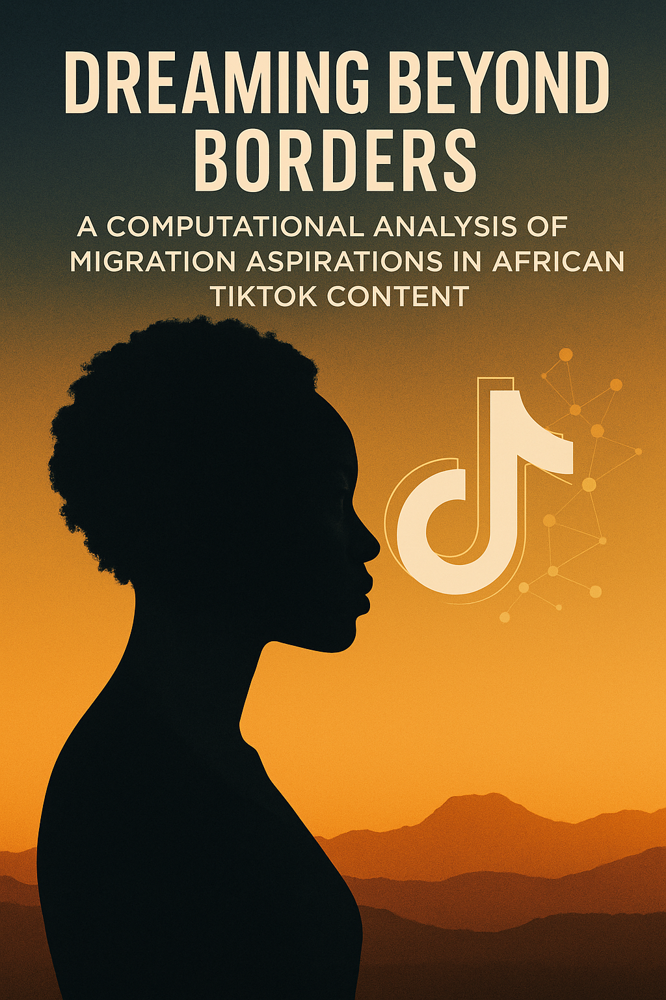

# Dreaming-Beyond-Borders-A-Computational-Analysis-of-Migration-Aspirations-in-African-TikTok-Content

Investigating how TikTok shapes migration aspirations (topics, traction and then “move abroad” ) content by African creators. Influence of social media or perceptions of migration to the West African content.

### Core Research Questions
We aim to answer the following questions through data collection and computational analysis:

* RQ1 (Themes): What are the dominant thematic narratives (e.g., "glamorization/flexing," "practical advice," "cultural challenges," "nostalgia") present in TikTok videos created by and for Ghanaians about life in the West?

* RQ2 (Sentiment & Engagement): What is the overall sentiment (positive, negative, neutral) of these narratives, and is there a correlation between sentiment and audience engagement (likes, comments, shares)? Do critical or challenging narratives receive as much traction as aspirational ones?

* RQ3 (Representation): How do these curated digital narratives potentially create a distorted "migration bias," and what are the implied societal implications for Ghanaian youth?

